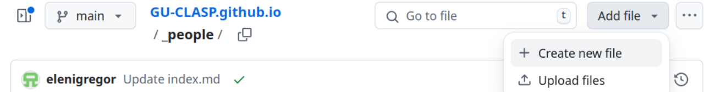

# README

* [Adding or Editing people](#adding-or-editing-people)
* [Adding or Editing events](#adding-or-editing-events)
* [Developing this web site](#developing-this-web-site)
    * [Preparing your system](#preparing-your-system)
    * [Creating pages and using layouts](#creating-pages-and-using-layouts)
    * [Styling](#styling)
    * [Committing changes](#committing-changes)
        * [If you made your changes in 'main'](#if-you-made-your-changes-in-main)
        * [If you made your changes in 'dev'](#if-you-made-your-changes-in-dev)
    * [Relevant Doc Links](#relevant-doc-links)

## Adding or Editing people

### Using the web interface

Go to the dir [_people](https://github.com/GU-CLASP/GU-CLASP.github.io/tree/main/_people). Then click on the button `Add File` as seen in the picture below.


Create an index.md by adding a path to it with the persons name, for example:
```(text)
john-doe/index.md
```

Here's an example of what the index.md should contain:

```(markdown)
---
name: "John Doe"
role: 4
title: "PhD Student"
profileImage: "john_doe.jpg"
---

John Doe is a PhD student ...
```

`title` is what is shown as the persons title on the persons page.

`role` will determine how the person is listed on the [people page](https://gu-clasp.github.io/people/).
Here are the different roles available:
| role | title |
| --- | --- |
| 0 | Acting Director |
| 1 | Coordinating Director |
| 2 | Administrator |
| 3 | Researcher |
| 4 | PhD Student |
| 5 | Past Member |
| 6 | Post Doctoral Researcher |

A profile image needs to be uploaded separately. Click on the persons directory where the `index.md` is shown. Then click `Add File` and select `Upload files`. The profile image should be quite small, or it will make the pages where it shown slower to load. A width of 300px is fine.

## Adding or Editing events

TODO...

## Developing this web site

This web site uses standard [Github Pages](https://docs.github.com/en/pages) functionality with [Jekyll](https://jekyllrb.com/)
and the [Liquid](https://shopify.github.io/liquid/) syntax.

In short, we're using Ruby at the bottom with the framework Jekyll to generate a static html site. All the coding is done either in html with liquid or markdown. See source files in this repo for examples.

If you want to make substantial changes to this web site by adding pages or
editing css, you will want to build and test locally before pushing your code.

### Preparing your system

It's best to make changes in a different branch. If you want to do your work in a separate `dev` branch, do:

```(bash)
git checkout -b dev
```

First, make sure to [install Jekyll](https://jekyllrb.com/docs/installation/)

To build the site and start a local testing server:
```(bash)
bundle exec jekyll serve
```

Got to [http://127.0.0.1:4000](http://127.0.0.1:4000) to see the web site.

When you build the web site, a new dir is created called `_site`. It contains the build output in the form of static html files. This dir is ignored in [.gitignore](https://github.com/GU-CLASP/GU-CLASP.github.io/blob/main/.gitignore).

Each time you edit and save a file, the web site is automatically regenerated, so no need to restart the server in between.

### Creating pages and using layouts

All pages, except for the [home page](https://github.com/GU-CLASP/GU-CLASP.github.io/blob/main/index.html) are put in [_pages](https://github.com/GU-CLASP/GU-CLASP.github.io/tree/main/_pages).

A page can either be a html file or a markdown file. Important to note is that each page needs to have a title in order to be displayed correctly. Make sure to add this to the top of the page (both html and markdown pages requires this):

```(html)
---
title: Page Title
---
```

If you have several pages that all share html code you can create a layout for those. Check existing layouts in
[_layouts](https://github.com/GU-CLASP/GU-CLASP.github.io/tree/main/_layouts)
to see examples. Then, to use a layout in your newly created pages, make sure the top of the page has this:

```(html)
---
title: Page Title
layout: your_layout
---
```

If no layout is selected for a page, the default layout will be used (configured in [_config.yml](https://github.com/GU-CLASP/GU-CLASP.github.io/blob/main/_config.yml)).

### Styling

All styling is done in [style.css](https://github.com/GU-CLASP/GU-CLASP.github.io/blob/main/assets/style.css)

### Committing changes

You've tested your changes locally and now want to commit and push your changes. First, check which branch you are using:

```(bash)
git branch
```

#### If you made your changes in 'main'

If you didn't create a `dev` branch, but made your changes in `main`, the procedure is slightly simpler.
```(bash)
git add .
git commit "write something informative here"
git pull --rebase  # rebase your changes against any possible changes at remote
git push origin main
```

#### If you made your changes in 'dev'

First commit your changes:

```(bash)
git add .
git commit -m "write something informative here"
```

Then, make sure you pull the latest changes from `main`:
```(bash)
git checkout main
git pull origin main
```

Rebase your commit in `dev` so it ends up being on top of everything else:
```(bash)
git checkout dev
git rebase main
```

Finally merge to main and push your changes:
```(bash)
git checkout main
git merge dev
git push origin main
```

After changes are pushed it takes a couple of minutes before the web site is rebuilt and published.

### Relevant Doc Links

* [Github Pages](https://docs.github.com/en/pages)
* [Jekyll](https://jekyllrb.com/docs/installation/)
* [Liquid](https://shopify.github.io/liquid/)
