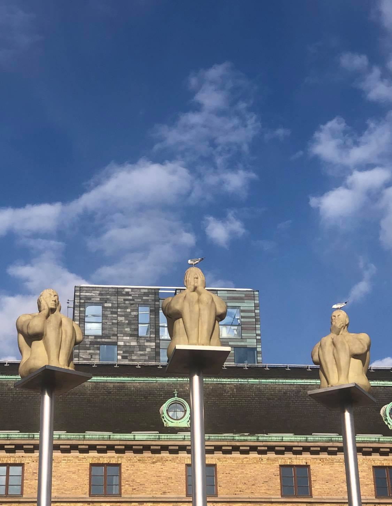

[Proceedings](https://aclanthology.org/2021.reinact-1.0/)

Reasoning and Interaction (ReInAct) is a conference organized by the Centre for Linguistic Theory and Studies in Probability (CLASP), https://www.gu.se/en/clasp at the Department of Philosophy, Linguistics and Theory of Science (FLoV), https://www.gu.se/flov/english.  It is sponsored by SIGSEM http://sigsem.org, the ACL special interest group on semantics. The ReInAct conference proceedings will be published online in the ACL Anthology for 2021 as a SIGSEM workshop event. The conference will also include a shared task on Natural Language Inference in Dialogue. 

ReInAct will bring together researchers interested in computationally relevant approaches to reasoning and interaction in natural language. ReInAct is open to Machine Learning, Symbolic and Experimental approaches, as well as combinations of these. For more info visit: https://sites.google.com/view/reinact2021/home

