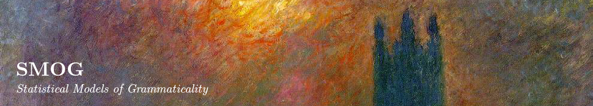
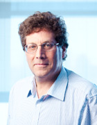
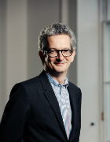
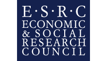

[Shalom Lappin](/people/shalom-lappin/) - Principal Investigator

[Alexander Clark](http://www.cs.rhul.ac.uk/home/alexc/) - Senior Researcher

[Jey Han Lau](http://www.dcs.kcl.ac.uk/staff/lappin/smog/personal/jeyhan.html) - Research Associate

Gianluca Giorgolo - Researcher

Jekaterina Denissova - Project PhD student

Monika Podsiadlo - Project PhD student

