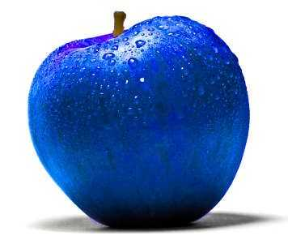

# Cognitive Systems Group

In the Cognitive systems research group we are looking at formal and distributional models (and anything in between) of language used by situated agents interacting with each other and with the physical world around them through action and perception. We investigate areas such representations of meaning in computational approaches to language, action, and perception, for example of spatial descriptions, generations and interpretation of scene description, multi-modal communication, situated dialogue systems, and other.

### Members

* [Simon Dobnik (group leader)](https://www.gu.se/en/about/find-staff/simondobnik)
* [Nikolai Ilinykh](https://www.gu.se/en/about/find-staff/nikolaiilinykh), [personal page](https://nilinykh.github.io/web.py/)
* [Vidya Somashekarappa](https://www.gu.se/om-universitetet/hitta-person/vidyasomashekarappa)
* [Robin Cooper](https://www.gu.se/en/about/find-staff/robincooper)
* [Aram Karimi](https://www.gu.se/en/about/find-staff/aramkarimi)
* [Elham Alighardash](https://scholar.google.com/citations?user=RP3j9S8AAAAJ&hl=en)

### Previous members

* [Adam Ek](https://www.gu.se/en/about/find-staff/adamek), [personal page](https://adamlek.github.io/)
* [Bill Noble](https://www.gu.se/en/about/find-staff/billnoble)
* [Vladislav Maraev](https://www.gu.se/om-universitetet/hitta-person/vladislavmaraev)
* [Tewodros Gebreselassie](https://www.gu.se/om-universitetet/hitta-person/tewodrosgebreselassie)
* [Kathrein Abu Kwaik](https://scholar.google.com/citations?user=JvibGVoAAAAJ&hl=en) (Chatrine Qwaider)
* [Wafia Adouane](https://www.semanticscholar.org/author/Wafia-Adouane/3449178)
* [Mehdi Ghanimifard, publications](https://www.linkedin.com/in/mmehdig/?originalSubdomain=se)

Several other members of CLASP have occasionally collaborated with the group.

### Masters students (theses)

* Dominik Künkele, learning through interaction
* Ekaterina (Katya Voloshina), probing grounded language models
* Chen Xi, grounding relations in object affordances

Join as a [postdoc](https://web103.reachmee.com/ext/I005/1035/job?site=7&lang=UK&validator=9b89bead79bb7258ad55c8d75228e5b7&job_id=30194) or a [PhD student](https://web103.reachmee.com/ext/I005/1035/job?site=7&lang=UK&validator=9b89bead79bb7258ad55c8d75228e5b7&job_id=30182) in the associated [Grandma Karl research environment](https://spraakbanken.gu.se/projekt/mormor-karl)

Join us every even Friday in our [reading group](https://gu-clasp.github.io/language-and-perception/meetings/)

Attend [a doctoral course](https://gu-clasp.github.io/language-and-perception/courses/)

### News

* 2023-05-15: We are co-organising the Workshop on Resources and representations for under-resourced languages and domains (RESOURCEFUL-2023) at [NoDaLiDa](https://www.nodalida2023.fo/nodalida-2023-t%C3%B3rshavn-faroe-islands), [website](https://resourceful-workshop.github.io/resourceful-2023/index.html)
* 2023-05-11: PhD position within the Gradma Karl research environment, deadline 27 June, [more details](https://web103.reachmee.com/ext/I005/1035/job?site=7&lang=UK&validator=9b89bead79bb7258ad55c8d75228e5b7&job_id=30182)
* 2023-05-02: Postdoc position, deadline 1 June: Postdoctoral Researcher in Computational linguistics with specialisation in language grounding to vision, robotics, and beyond, [more details](https://web103.reachmee.com/ext/I005/1035/job?site=7&lang=UK&validator=9b89bead79bb7258ad55c8d75228e5b7&job_id=30194)
* 2023-04-28: article in GU-Journal 02-2023: Language models with a human touch, read [here](https://issuu.com/universityofgothenburg/docs/guj2-2023english/s/23450816)
* 2023-02-02: [annual group report](https://github.com/GU-CLASP/cogsys-wiki/blob/main/paperwork/2023-02-02-group-report-for-2022.md)
* 2022-05-25: Phd thesis defence: Chatrine Qwaider: Resources and Applications for Dialectal Arabic: the Case of Levantine, [more details](https://gu-clasp.github.io/research/cognitive-systems-group/(https://www.gu.se/evenemang/chatrine-qwaider-resources-and-applications-for-dialectal-arabic-the-case-of-levantine))

### Courses

##### Masters in Language Technology (MLT) and free-standing online courses
* Computational semantics, spring 2023
* AI Cognitive systems, autumn 2022

##### Doctoral courses
* Representations of Meaning (ROM)
* Language, Action and Perception (APL)
* Machine Learning Methods For Vision and Language (ML-V&L)

### Resources
* Reading group
* Wiki

### Contact
* Mailing list cogsys (at) listserv (dot) gu (dot) se, subscribe
* Discord (to get added, send Simon your discord id)

Picture of the blue apple taken from [here](https://i.pinimg.com/736x/06/ea/40/06ea407e5694ba51977d65aaafe428ea.jpg).
