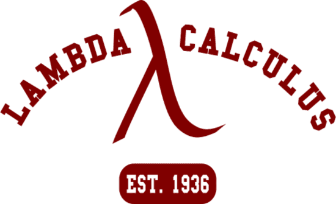

# Type Theory Research Group

The Type Theory group is devoted to the study of Type Theoretical methods for NLP and Formal Semantics. The group is led by Rasmus Blanck.

### Group members:
* Rasmus Blanck
* Ellen Breitholtz
* Shalom Lappin
* Robin Cooper
* Staffan Larsson

The group’s activities involve invited talks by prominent researchers in the field, organizing workshops on Type Theory and exploring connections between Type Theory and Probability and/or Machine Learning.
