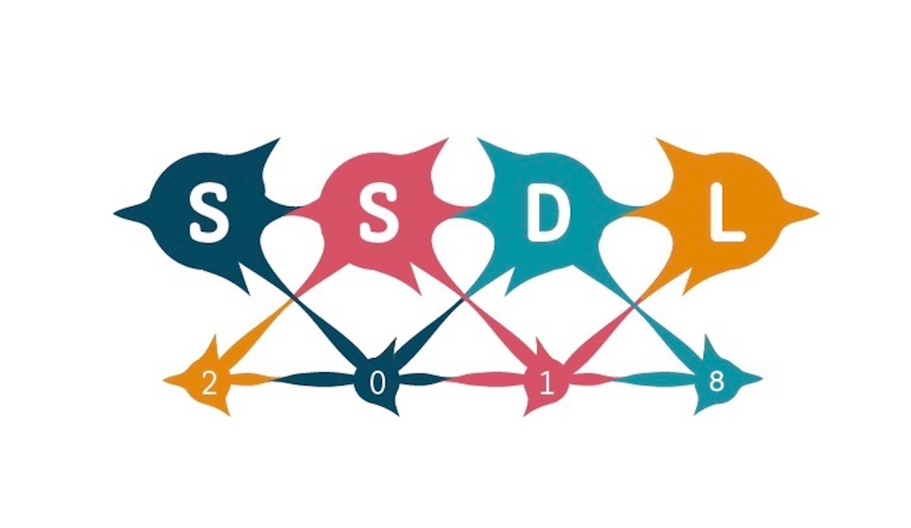

The 2nd Swedish Symposium on Deep Learning will be held at Chalmers
University of Technology, 5-6 September, 2018. 

The premier event in Sweden bringing together top researchers in Deep
Learning across academia and industry. This year there will be thematic
sessions on Vision, Natural Language Technologies and Health
Engineering, three of the most high impact areas for Deep Learning
today.

Keynote Speakers:
* [Chris Dyer](http://www.cs.cmu.edu/~cdyer/), Carnegie Mellon
University \
* [Joakim Nivre](https://stp.lingfil.uu.se/~nivre/), Uppsala \
* [Christian Igel](https://christian-igel.github.io/), Copenhagen \
* [Atsuto Maki,](https://www.kth.se/profile/atsuto) KTH \
[Hossein Azizpour](http://www.csc.kth.se/~azizpour/), KTH Royal
Institute of Technology \
* [Chiranjib
Bhattacharyya](https://scholar.google.com/citations?user=SbYoEmQAAAAJ&hl=en),
Indian Institute of Science.\
 
Organised by Chalmers Area of Advance Information and Communication
Technology, Chalmers Department of Computer Science and Engineering, and
CLASP at University of Gothenburg. For more info, have a look
[here](https://clasp.gu.se/news-events/the-second-swedish-symposium-on-deep-learning-). 

Location: Wallenberg Conference Center, Medicinaregatan 20, Gothenburg\
Starts: 05 September, 2018, 12:00\
Ends: 06 September, 2018, 17:00

