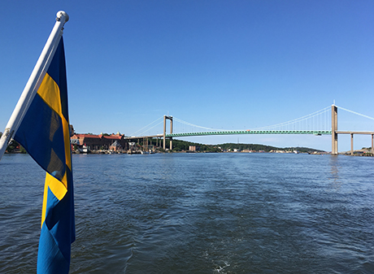

* [Call for papers](./call)
* [Registration](./registration)
* [Accomodation](./accomodation)
* [Invited abstracts](./invited-abstracts)
* [Programme](./programme)

The study of dialogue investigates how natural language is used in interaction between interlocutors and how coordination and successful communication is achieved. Dialogue is multimodal, situated and embodied, with non-linguistic factors such as attention, eye gaze and gesture critical to understanding communication. However, studies on dialogue and computational models such as dialogue systems have often taken for granted that we align our perceptual representations, which are taken to be part of common ground (grounding in dialogue, Clark, 1996). They have also typically remained silent about how we integrate information from different sources and modalities and the different contribution of each of these. These assumptions are unsustainable when we consider interactions between agents with obviously different perceptual capabilities, as in the case in dialogues between humans and artificial agents, such as avatars or robots.

Contrarily, studies of perception have focussed on how an agent interacts with and interprets the information from their perceptual environment. There is significant research on how language is grounded in perception, how words are connected to perceptual representations and agent's actions and therefore assigned meaning (grounding in action and perception, Harnad, 1990). In the last decade there has been impressive progress on integrated computational approaches to language, action, and perception, especially with the introduction of deep learning methods in the field of image descriptions that use end-to-end training from data. However, these have a limited integration to the dynamics of dialogue and often fail to take into account the incremental and context sensitive nature of language and the environment.

The aim of this workshop is to initiate a genuine dialogue between these related areas and to examine different approaches from computational, linguistic and psychological perspectives and how these can inform each other. It will feature invited talks by leading researchers in these areas, and high level contributed papers, presented as posters, selected through open competition and rigorous review.

The workshop is collocated with [The Tenth Scandinavian Logic Symposium (SLS 2018)](http://scandinavianlogic.org/sls2018), June 11-13, 2018

Contact email address: <dap2018@easychair.org>

