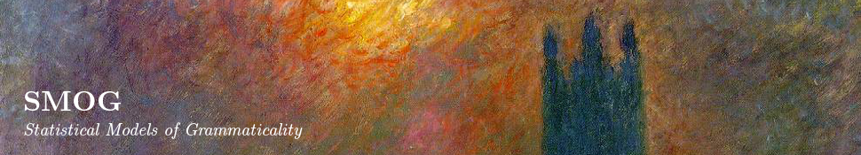

The question of whether it is possible to characterise grammatical
knowledge in probabilistic terms is central to determining the
relationship of linguistic representation to other cognitive domains. We
present a statistical model of grammaticality which maps the
probabilities of a statistical model for sentences in parts of the BNC
into grammaticality scores, using various functions of the parameters of
the model. Experiments with a classifier on test sets containing
different levels of syntactic infelicity have achieved encouraging
levels of accuracy. These results suggest that it may be possible to
characterise grammaticality judgements in probabilistic terms using an
enriched language model (for more details, see
[here](papers/cgl_cogsci13.pdf)).

In a different set of experiments, we use a set of enriched n-gram
models to track grammaticality judgements for various kinds of passive
sentences in English. These experiments indicate that our n-gram models
achieve high accuracy in identifying ill-formed passives in which
ill-formedness depends on local relations within the n-gram frame, but
they are far less successful in detecting non-local relations which
produce unacceprability in other types of passive construction. We take
these results to indicate some of the strengths and limitations of word
and lexical class n-gram models as candidate representations of
speakers\' grammatical knowledge (for more details, see
[here](papers/cgl_cmcl13.pdf)).

[A sample graph of the performance of our n-gram models on the passive
data](graph1.png).

In our Cognitive Science 2014 paper [Measuring Gradience in Speakers\'
Grammaticality
Judgements](papers/lcl_cogsci14.pdf)
we present evidence that grammaticality is a gradient rather than a
binary property. Details of the experiments and the results are given in
the paper.

In recent work we use unsupervised language models trained on corpora
from a variety of domains and languages to predict speakers\'
grammatical acceptability judgements. We apply normalising measures to
the probability distributions that these models generate in order to
filter out the effects of sentence length and word frequency. These
measures give us predicted grammatical acceptability scores. We evaluate
these models against the mean acceptability judgements for crowd sourced
annotated test sets in which grammatical infelicities have been
introduced. We also test the models against sets of crowd sourced
annotated linguists\' examples.

This work is described in our ACL 2015 paper [Unsupervised Prediction of Acceptability Judgements](papers/lcl_acl15.pdf), and in a recent conference paper [Predicting Acceptability Judgements with Unsupervised Language Models](papers/lcl_iscol2015.pdf).

## Datasets

The annotated data sets for our experiments are available below, and the
open source toolkit for running our unsupervised models can be accessed
from our software page. Datasets with human-annotated acceptability
ratings (all files are tab-delimited csv files):

-   [Adger](data/adger.csv)
-   [Adger Filtered](data/adger_filtered.csv)
-   [BNC](data/bnc.csv)
-   [English Wikipedia](data/enwiki.csv)
-   [Spanish Wikipedia](data/eswiki.csv)
-   [German Wikipedia](data/dewiki.csv)
-   [Russian Wikipedia](data/ruwiki.csv)

