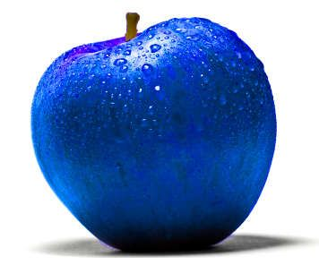

In the Language and Perception research group we are looking at formal and distributional models (and anything in between) of language used by situated agents interacting with each other and with the physical world around them through action and perception. We investigate areas such representations of meaning in computational approaches to language, action, and perception, for example of spatial descriptions, generations and interpretation of scene description, multi-modal communication, situated dialogue systems, and other.

Members of the group: 

Researchers:
- Simon Dobnik (group leader)
- Robin Cooper
- Staffan Larsson
- Shalom Lappin
- Christine Howes
- Ellen Breitholtz
- Sharid Loáiciga

PhD students:
- Mehdi Ghanimifard
- Wafia Adouane
- Yuri Bizzoni
- Sylvie Saget
- Vladislav Maraev
- Bill Noble

The group runs a bi-weekly [reading group](meetings).

It offers two standing PhD courses:

  - Language, Action, and Perception (for more info: [English](https://gul.gu.se/public/courseId/82742/lang-en/publicPage.do) and [Swedish](./Syllabus/Language, Action and Perception.pdf)). 
  - Representation of Meaning (for more info: [English](https://gul.gu.se/public/courseId/82744/lang-en/publicPage.do) and [Swedish](./Syllabus/Representations of Meaning.pdf)).

In 2018 we also organised (together with the Dialogue group) Workshop on Dialogue and Perception. For more details, please see [here](https://gu-clasp.github.io/events/conferences/dialogue-and-percetion-workshop/).

### News

  - Check out the draft of the report of the group's activities on [the wiki](https://github.com/GU-CLASP/language-and-perception/wiki/Annual-report-2018).
  
Picture of the blue apple taken from [here](https://s-media-cache-ak0.pinimg.com/736x/06/ea/40/06ea407e5694ba51977d65aaafe428ea.jpg).
