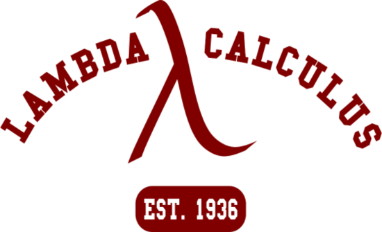

---
The Type Theory group is devoted to the study of Type Theoretical methods for NLP and Formal Semantics. The group is led by Stergios Chatzikyriakidis.

Group members:

-	Stergios Chatzikyriakidis
-	Jean-Philippe Bernardy
-	Robin Cooper
-	Staffan Larsson
-	Vlad Maraev 
-	Bill Noble

The group’s activities involve invited talks by prominent researchers in the field, organizing workshops on Type Theory and exploring connections between Type Theory and Probability and/or Machine Learning. 

